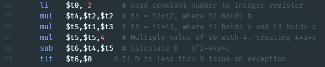
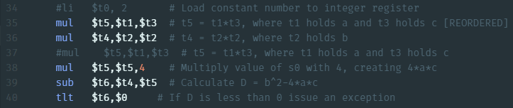
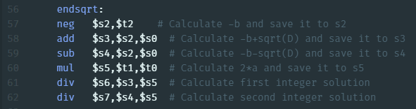
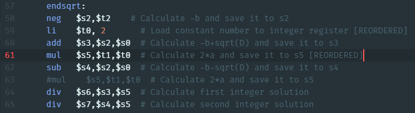

# Lab 4

## Introduction

This lab serves to introduce us to pipelined processors and how they work. Further more, we learn how to deal with hazards within assembly programs
(rather how to prevent them), as well as how to handle exceptions and interrupts.

## Assignment 1
Control Unit  |  RegDst |  ALUSrc | MemToReg  |  RegWrite | MemRead  | MemWrite  | Branch  |  ALUOp |  
:--:|:---:|:---:|:---:|:---:|:---:|:---:|:---:|:---:|:--:|
addi $t0, $t0, 10  | 0  | 1  | 0  | 1  | 0  | 0  | 0  | 00 |
sw $t0, 32($s0)  | x  | 1  | x  | 0  | 0  | 1  | 0  |  00 |
bne $t2, $t0, QUIT  | x  | 0  | x  | 0  | 0  | 0  | 1  | 01 |
xor $s0, $t1, $t2  | 1  | 0  | x  | 1  | 0  | 0  | 0  | 00 |
j Print  | x  | x  | x  | 0  | 0  | 0  | 0  | 00 |   

## Assignment 2

## Assignment 3

## Assignment 4

Please refer to *quad_sol_reordered.asm* for this assignment.

First block:  

First block [REORDERED]:  

The reordered first block would take 12 cycles < 14 cycles = original first block.

Second block:  

Second block [REORDERED]:  

The reordered second block would take 10 cycles < 11 cycles = original second block.

The conclusion can be made drawn that 3 clock cycles were saved overall, and the reordering of the code did not affect the output at all.
